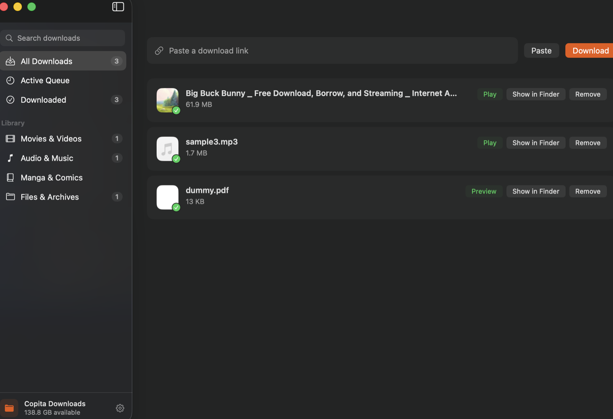

<div align="center">


# Copita

**A fast, all‑in‑one download manager for video, audio, streams, files and torrents.**

Paste a link — Copita works out what it is and downloads it, in parallel, with resume.

[](LICENSE)


[](https://ko-fi.com/nurikjim)



</div>

---

## Contents

- [What it is](#what-it-is)
- [Features](#features)
- [Install](#install)
- [Run](#run)
- [Browser extension](#browser-extension)
- [Native macOS app](#native-macos-app-optional)
- [Configuration](#configuration)
- [Development](#development)
- [Support](#support)
- [License](#license)

---

## What it is

Copita runs a small local service with a web interface and a command line. It
takes a link — a video, a playlist, an audio track, an `.m3u8` / `.mpd`
stream, a cloud‑drive folder, a magnet link, or just a web page with media
buried in it — figures out what it is, and downloads it.

It runs on **macOS, Windows and Linux**. A native macOS app is included as an
optional wrapper.

---

## Features

<table>
<tr>
<td width="50%" valign="top">

### 🎬 Video &amp; streaming
- 4K / HDR / 60fps, Shorts, playlists (each item its own task, foldered)
- Time‑range clips — grab just a slice of a long video
- 1,000+ video sites, plus any `<video>` / embedded player Copita can see

### 🎧 Audio
- Full‑quality music &amp; podcast downloads with cover art and tags
- Album / playlist expansion, one track per file
- Extract audio only from any video

### 📚 Documents &amp; images
- PDF, EPUB, Scribd, and flipbook viewers → clean PDF
- Manga / webcomic chapters packaged as CBZ
- Single images from any page

</td>
<td width="50%" valign="top">

### 🔗 Streams &amp; transfers
- HLS (`.m3u8`) — variant selection + AES‑128 decryption
- DASH (`.mpd`) — separate video/audio muxed together
- BitTorrent / magnet links — DHT, resume, sequential *(optional)*
- Direct HTTP/HTTPS — up to 32 parallel connections, byte‑accurate resume

### ☁️ Files &amp; cloud
- Google Drive &amp; MEGA — single files or a whole shared folder, recursively
- MediaFire, Dropbox, Gofile, pixeldrain, 1fichier, Catbox and more —
  ad‑gates and wait timers handled for you

### 🧭 Manager
- Concurrent‑download cap with a queue
- Global speed limit, proxy (HTTP / SOCKS5), TLS‑verify toggle
- Pause / resume / retry, playlist group rows, in‑app preview

</td>
</tr>
</table>

When a link isn't a known site, Copita loads the page and finds the real
media or download link behind it.

---

## Install

### Prerequisites

| Requirement | Notes |
|---|---|
| **Python 3.11+** | 3.12+ recommended |
| **FFmpeg** | Combines and converts media. Must be on your `PATH`. |

Everything else is a Python package installed in the next step.

### 1 · Get the code

```bash
git clone https://github.com/sstoicsnapshots-lang/copita-downloader.git
cd copita-downloader
```

### 2 · Install

<details open>
<summary><b>macOS / Linux</b></summary>

```bash
python3 -m venv .venv
source .venv/bin/activate
pip install -r requirements.txt          # or:  pip install -e .
```

Install FFmpeg if you don't have it:

```bash
brew install ffmpeg        # macOS (Homebrew)
sudo apt install ffmpeg    # Debian / Ubuntu
sudo dnf install ffmpeg    # Fedora
sudo pacman -S ffmpeg      # Arch
```
</details>

<details>
<summary><b>Windows</b></summary>

```powershell
py -m venv .venv
.venv\Scripts\Activate.ps1
pip install -r requirements.txt          # or:  pip install -e .
```

Install FFmpeg (any one of):

```powershell
winget install Gyan.FFmpeg
choco install ffmpeg
```

Or download a build from the FFmpeg site and add its `bin` folder to `PATH`.
</details>

### 3 · Optional extras

```bash
# Magnet / torrent support
pip install libtorrent

# Headless‑browser fallback for a few JavaScript‑heavy pages
pip install playwright && playwright install chromium
```

---

## Run

### Web interface

```bash
python -m copita.cli serve --open
```

Starts the local service on **http://127.0.0.1:8888** and opens it in your
browser. Paste a link, press **Download**, watch it go. Use `--port 9000` for
a different port.

### Command line

```bash
# Download anything
python -m copita.cli download "https://example.com/watch?v=..."

# Audio only, best available quality
python -m copita.cli download "https://example.com/watch?v=..." -a

# More connections for a direct file or stream
python -m copita.cli download "https://example.com/big.zip" -t 16

# Magnet link
python -m copita.cli download "magnet:?xt=urn:btih:..."

# Inspect a page for media without downloading
python -m copita.cli sniff "https://example.com/gallery/123"
```

Downloads go to `~/Downloads/Copita Downloads` by default. Change it in the
web UI (**Settings**) or with `COPITA_DOWNLOAD_DIR`:

```bash
COPITA_DOWNLOAD_DIR="/path/to/folder" python -m copita.cli serve
```

---

## Browser extension

`copita-extension/` is a Manifest V3 extension for Chrome, Brave, Edge or any
Chromium browser. With the local service running it adds:

- A **download button** over the video player on any page
- A **clip** control to grab a time range
- A list of every downloadable resource the current page has loaded, with the
  exact request headers — so Copita can fetch things that need a referer,
  origin or session cookie
- An optional toggle to route the browser's own downloads through Copita

**Install (unpacked):**

1. Open `chrome://extensions`
2. Turn on **Developer mode**
3. **Load unpacked** → select the `copita-extension/` folder

The extension talks to `http://127.0.0.1:8888`, so start the service first.

---

## Native macOS app (optional)

`copita-macos/` builds a standalone `Copita.app` that bundles the service and
launches it for you — no terminal needed.

```bash
cd copita-macos
./build.sh
open Copita.app
```

Requires the Xcode command‑line tools (`xcode-select --install`).

---

## Configuration

Settings live in `.copita_settings.json` next to your download folder and are
also editable in the web UI (**Settings**):

- Download folder
- Simultaneous downloads and connections per file
- Global speed limit
- Proxy (`http://…` or `socks5://…`) and TLS‑certificate verification
- Which browser's session to use for sites you're signed into

---

## Development

```bash
# Full test suite
python -m unittest discover -s tests

# Real‑network / hard‑scenario suite
python tests/test_hard_downloads.py
```

```
copita/            core engines + FastAPI service + CLI
copita-web/         web interface (static HTML/CSS/JS)
copita-extension/   Chromium browser extension (MV3)
copita-macos/       native macOS app wrapper (Swift)
tests/              unit + integration tests
```

Contributions are welcome — please run the test suite before opening a pull
request. See [CONTRIBUTING.md](CONTRIBUTING.md).

---

## Support

Copita is free and open source. If it saved you some time, you can

<a href="https://ko-fi.com/nurikjim"></a>

---

## Legal

Copita is a general‑purpose download tool. Only download content you own or
have the right to download, and follow the terms of the sites you use it
with.

## License

Copyright © 2026 Copita contributors.

Distributed under the **GNU General Public License v3.0**. You may
redistribute and modify it under the terms of the GPL as published by the
Free Software Foundation. It comes with **no warranty**. See
[LICENSE](LICENSE) for the full text.


https://github.com/user-attachments/assets/6686453a-d930-43dd-ab68-884dc4b8ec25


